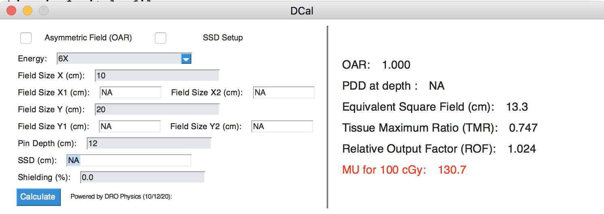

# DCAL

This contain the source code and executable of the new DCAL. 

Interface of the GUI looks like this: 

  

# Physics 
1. Input Data: ROF and PDD from Truebeam Golden Beam for 6X and 10X 
2. ROF and PDD are 2D-interpolated with scipy.interpolate
2. Equivalent Square Field calculated from: 

  

3. TMR is calculated using the formula from Khan Medical Physics Eqn. (10.4)

  

4. The Phantom Scatter factor is calculated using a fit derived from IMSURE by GuanHeng: Sp = (0.2205 * fs) / (5.883 + fs) + 0.8597

5. The MU for SAD setting is calculated using formula from Khan Medical Physics Eqn. (10.13)

  

6. The MU and PDD for SSD setting using the formula from Khan Medical Physics Eqn. (10.14)

  

7. The OAR currently is calculated from the Truebeam Golden beam beam profile data. 3D interpolation was performed along the depth, Field size and off-axis position parameters. The off-axis point is chosen to be the center of the field. This method cannot be used if OAR is required for both the X and Y direction. 

# Software
This is written using python. The GUI is constructed with pysimplegui and compiled with pyinstaller module. There are two main modes of distribution. One is a single exe file but is slow to start up due to unpacking of dependency to TEMP folder (could be worsen with anti-virus scanning through each file). The second is an exe with a host of dependency files. This is faster but file size is larger. The GUI is the main reason for the huge dependency library. If only Console exe is required, a single exe file will be way faster. 

Please download the Windows Executable from the dropbox link below: 

https://www.dropbox.com/sh/ufgkp2aq7ngstcu/AAB9E9Jc1htorVXomQ11Dzu3a?dl=0

# To-do Lists: 
1) Include Wedge Factor
